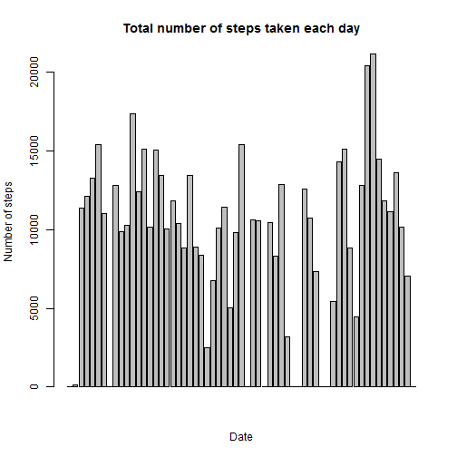
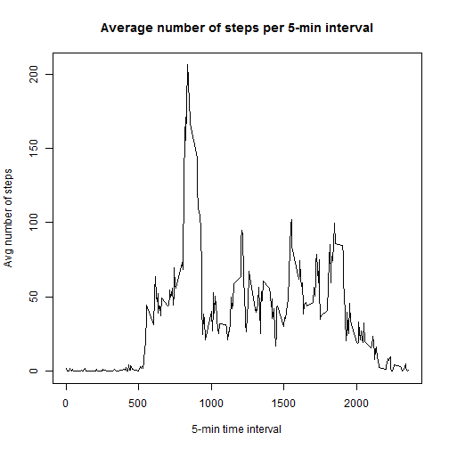
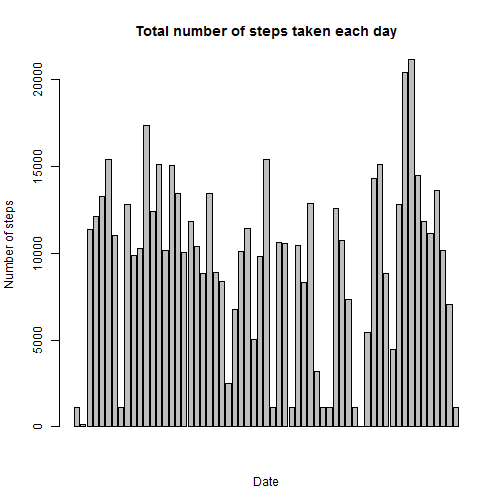
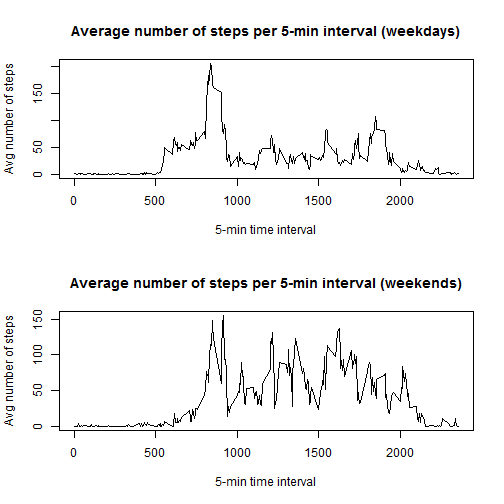

## Reproducible Research: Peer Assessment 1


### Loading and preprocessing the data

This is the R code describing the loading and preprocessing of the data. 


```r
setwd("C:/Users/On Ying/Documents/Coursera/5ReproducibleResearch/ProgAss1")
initial <- read.csv("activity.csv", nrows=5)
classes <- sapply(initial, class)
classes
activity <- read.csv("activity.csv", colClasses=c("integer", "factor", "integer"))
activity$date <- strptime(activity$date, "%Y-%m-%d")
```

### What is mean total number of steps taken per day?

The total number of steps taken per day are shown in the histogram. 


```r
library(plyr)
totalstepsperday <- ddply(activity, .(date), summarize, sum=sum(steps, na.rm=TRUE))
barplot(totalstepsperday$sum, main ="Total number of steps taken each day", 
            ylab ="Number of steps", xlab ="Date")
```

 

Here, the mean and median number of steps taken per day are shown.


```r
stepsperday <- ddply(activity, .(date), summarize, mean=mean(steps, na.rm=TRUE), 
                     median=median(steps, na.rm=TRUE))
stepsperday
```

```
##          date    mean median
## 1  2012-10-01     NaN     NA
## 2  2012-10-02  0.4375      0
## 3  2012-10-03 39.4167      0
## 4  2012-10-04 42.0694      0
## 5  2012-10-05 46.1597      0
## 6  2012-10-06 53.5417      0
## 7  2012-10-07 38.2465      0
## 8  2012-10-08     NaN     NA
## 9  2012-10-09 44.4826      0
## 10 2012-10-10 34.3750      0
## 11 2012-10-11 35.7778      0
## 12 2012-10-12 60.3542      0
## 13 2012-10-13 43.1458      0
## 14 2012-10-14 52.4236      0
## 15 2012-10-15 35.2049      0
## 16 2012-10-16 52.3750      0
## 17 2012-10-17 46.7083      0
## 18 2012-10-18 34.9167      0
## 19 2012-10-19 41.0729      0
## 20 2012-10-20 36.0938      0
## 21 2012-10-21 30.6285      0
## 22 2012-10-22 46.7361      0
## 23 2012-10-23 30.9653      0
## 24 2012-10-24 29.0104      0
## 25 2012-10-25  8.6528      0
## 26 2012-10-26 23.5347      0
## 27 2012-10-27 35.1354      0
## 28 2012-10-28 39.7847      0
## 29 2012-10-29 17.4236      0
## 30 2012-10-30 34.0938      0
## 31 2012-10-31 53.5208      0
## 32 2012-11-01     NaN     NA
## 33 2012-11-02 36.8056      0
## 34 2012-11-03 36.7049      0
## 35 2012-11-04     NaN     NA
## 36 2012-11-05 36.2465      0
## 37 2012-11-06 28.9375      0
## 38 2012-11-07 44.7326      0
## 39 2012-11-08 11.1771      0
## 40 2012-11-09     NaN     NA
## 41 2012-11-10     NaN     NA
## 42 2012-11-11 43.7778      0
## 43 2012-11-12 37.3785      0
## 44 2012-11-13 25.4722      0
## 45 2012-11-14     NaN     NA
## 46 2012-11-15  0.1424      0
## 47 2012-11-16 18.8924      0
## 48 2012-11-17 49.7882      0
## 49 2012-11-18 52.4653      0
## 50 2012-11-19 30.6979      0
## 51 2012-11-20 15.5278      0
## 52 2012-11-21 44.3993      0
## 53 2012-11-22 70.9271      0
## 54 2012-11-23 73.5903      0
## 55 2012-11-24 50.2708      0
## 56 2012-11-25 41.0903      0
## 57 2012-11-26 38.7569      0
## 58 2012-11-27 47.3819      0
## 59 2012-11-28 35.3576      0
## 60 2012-11-29 24.4688      0
## 61 2012-11-30     NaN     NA
```


### What is the average daily activity pattern?

This is a time series plot of the 5-minute interval (x-axis) and the average number of steps taken, averaged across all days (y-axis).


```r
stepsperinterval <- ddply(activity, .(interval), summarize, mean=mean(steps, na.rm=T))
plot(x=stepsperinterval$interval, y=stepsperinterval$mean, type='l', 
     main="Average number of steps per 5-min interval", xlab="5-min time interval", 
     ylab="Avg number of steps")
```

 

```r
maxinterval <- stepsperinterval$interval[stepsperinterval$mean == max(stepsperinterval$mean)]
```

The 5-minute interval (on average across all the days) that contains the maximum number of steps is 835.

### Imputing missing values


```r
missingsteps <- is.na(activity$steps)
summissing <- sum(missingsteps[missingsteps == TRUE])
```

The total number of missing values (i.e. the total number of rows with NAs) in the dataset is 2304.

Strategy to fill in missing values: 
If the steps value is missing for a certain row, the median for that 5 min interval will be filled in. A second dataset was created with the missing data filled in. 


```r
missingstrategy <- ddply(activity, .(interval), summarize, median=median(steps, na.rm=T))
merged = arrange(join(activity, missingstrategy), interval)
```

```
## Joining by: interval
```

```r
for (i in 1:length(merged$steps)){
    if (is.na(merged$steps[i])){
        merged$steps[i] = merged$median[i]
    }
}
```

Here is the histogram showing the total number of steps taken each day (including the filled in values). 


```r
totalstepsperday2 <- ddply(merged, .(date), summarize, sum=sum(steps, na.rm=TRUE))
barplot(totalstepsperday2$sum, main ="Total number of steps taken each day", 
        ylab ="Number of steps", xlab ="Date")
```

 

The mean and median total number of steps taken per day (including the filled in values) are reported here.


```r
stepsperday2 <- ddply(merged, .(date), summarize, mean=mean(steps, na.rm=TRUE), 
                     median=median(steps, na.rm=TRUE))
stepsperday2
```

```
##          date    mean median
## 1  2012-10-01  3.9618      0
## 2  2012-10-02  0.4375      0
## 3  2012-10-03 39.4167      0
## 4  2012-10-04 42.0694      0
## 5  2012-10-05 46.1597      0
## 6  2012-10-06 53.5417      0
## 7  2012-10-07 38.2465      0
## 8  2012-10-08  3.9618      0
## 9  2012-10-09 44.4826      0
## 10 2012-10-10 34.3750      0
## 11 2012-10-11 35.7778      0
## 12 2012-10-12 60.3542      0
## 13 2012-10-13 43.1458      0
## 14 2012-10-14 52.4236      0
## 15 2012-10-15 35.2049      0
## 16 2012-10-16 52.3750      0
## 17 2012-10-17 46.7083      0
## 18 2012-10-18 34.9167      0
## 19 2012-10-19 41.0729      0
## 20 2012-10-20 36.0938      0
## 21 2012-10-21 30.6285      0
## 22 2012-10-22 46.7361      0
## 23 2012-10-23 30.9653      0
## 24 2012-10-24 29.0104      0
## 25 2012-10-25  8.6528      0
## 26 2012-10-26 23.5347      0
## 27 2012-10-27 35.1354      0
## 28 2012-10-28 39.7847      0
## 29 2012-10-29 17.4236      0
## 30 2012-10-30 34.0938      0
## 31 2012-10-31 53.5208      0
## 32 2012-11-01  3.9618      0
## 33 2012-11-02 36.8056      0
## 34 2012-11-03 36.7049      0
## 35 2012-11-04  3.9618      0
## 36 2012-11-05 36.2465      0
## 37 2012-11-06 28.9375      0
## 38 2012-11-07 44.7326      0
## 39 2012-11-08 11.1771      0
## 40 2012-11-09  3.9618      0
## 41 2012-11-10  3.9618      0
## 42 2012-11-11 43.7778      0
## 43 2012-11-12 37.3785      0
## 44 2012-11-13 25.4722      0
## 45 2012-11-14  3.9618      0
## 46 2012-11-15  0.1424      0
## 47 2012-11-16 18.8924      0
## 48 2012-11-17 49.7882      0
## 49 2012-11-18 52.4653      0
## 50 2012-11-19 30.6979      0
## 51 2012-11-20 15.5278      0
## 52 2012-11-21 44.3993      0
## 53 2012-11-22 70.9271      0
## 54 2012-11-23 73.5903      0
## 55 2012-11-24 50.2708      0
## 56 2012-11-25 41.0903      0
## 57 2012-11-26 38.7569      0
## 58 2012-11-27 47.3819      0
## 59 2012-11-28 35.3576      0
## 60 2012-11-29 24.4688      0
## 61 2012-11-30  3.9618      0
```

These values differ slightly from the estimates from the first part of the assignment. The impact of imputing missing data on the estimates of the total daily number of steps is minor.


### Are there differences in activity patterns between weekdays and weekends?

Yes, there are small differences in activity patterns between the weekday and weekends, see the panel plot below. 
The  panel plot shows a time series plot of the 5-minute interval (x-axis) 
and the average number of steps taken, averaged across all week days or weekend days (y-axis). 


```r
for (i in 1:length(merged$date)){
    if (weekdays(merged$date[i])=="Saturday" | weekdays(merged$date[i])=="Sunday")
    {
        merged$daytype[i] <- "weekend" 
    } else {
        merged$daytype[i] <- "weekday" 
    }
}
temp <- ddply(merged, .(daytype, interval), summarize, mean=mean(steps, na.rm=T))
attach(merged)
```

```
## The following objects are masked from merged (position 3):
## 
##     date, daytype, interval, median, steps
```

```r
par(mfrow=c(2,1))
plot(x=temp$interval[temp$daytype=="weekday"], y=temp$mean[temp$daytype=="weekday"], type='l', 
     main="Average number of steps per 5-min interval (weekdays)", xlab="5-min time interval", 
     ylab="Avg number of steps")
plot(x=temp$interval[temp$daytype=="weekend"], y=temp$mean[temp$daytype=="weekend"], type='l', 
     main="Average number of steps per 5-min interval (weekends)", xlab="5-min time interval", 
     ylab="Avg number of steps")
```

 
